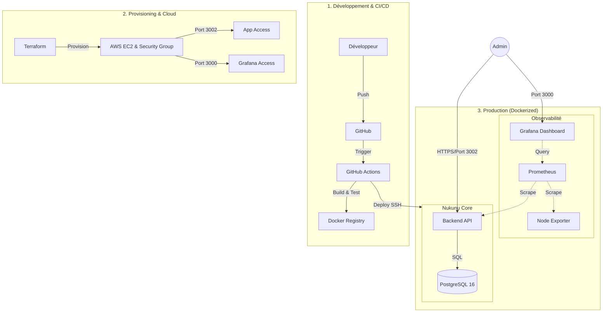

# Nukunu Solar — Plateforme SaaS d'Optimisation Énergétique

## Présentation du Projet
Nukunu Solar est une solution logicielle innovante conçue pour les acteurs de la filière photovoltaïque (**Installateurs, Fonds d'investissement, Industriels et Particuliers**). 

La plateforme centralise le monitoring en temps réel, la maintenance O&M, l'automatisation de la facturation et l'optimisation des flux énergétiques (stockage batterie et arbitrage marché) pour maximiser la rentabilité des actifs solaires.

---

## Architecture Détaillée

Le système repose sur une architecture distribuée, conteneurisée et hautement sécurisée, conçue pour la scalabilité et stabilisée pour la production.

### Schéma d'Architecture


### Couches Techniques
1. **Couche Présentation (Frontend)** : Interface SPA développée en Vanilla JS ES6 et CSS moderne. Intègre un moteur de thèmes dynamique et des tableaux de bord interactifs.
2. **Couche Logique (Backend API)** : Serveur Node.js sous Express.js assurant la logique métier, l'authentification JWT et l'exposition des métriques Prometheus.
3. **Couche Persistance (Base de Données)** : PostgreSQL 16 avec une structure relationnelle normalisée et isolation stricte par rôle.
4. **Monitoring & Observabilité** :
    - **Prometheus** : Collecte des métriques applicatives et système.
    - **Grafana** : Dashboards en temps réel pour la supervision (Port 3000).
    - **Node Exporter** : Monitoring des ressources matérielles du serveur AWS.
5. **Infrastructure & Orchestration** :
    - **Cloud** : Instance x86 EC2 t3.micro (AWS Free Tier) stabilisée (Swap 2Go + RAM optimisée).
    - **Orchestration** : Docker Compose (Production & Monitoring).
    - **Automatisation** : Terraform (IaC), Ansible et GitHub Actions pour le CI/CD.

### Visualisation Interactive (Cycle de Vie & Infrastructure)


---

## Aperçu de l'Interface (Dashboards Réels)

### 1. Monitoring & Stats Système
Supervision en temps réel des actifs solaires et de la santé du serveur AWS via Grafana.


### 2. Reporting & ESG
Analyses mensuelles et revenus financiers pour les fonds d'investissement.


### 3. Optimisation Énergétique
Gestion intelligente de l'auto-consommation et de l'arbitrage des prix du marché.


---

## Stack Technique
- **Backend** : Node.js (v22) / Express.js / JWT / prom-client
- **Frontend** : HTML5 / Modern CSS / Javascript ES6
- **Monitoring** : Grafana / Prometheus / Node Exporter
- **Base de Données** : PostgreSQL 16
- **Infrastructure** : AWS EC2 (Irlande) / Docker & Docker Compose
- **Automatisation** : Terraform / Ansible / GitHub Actions

---

## Installation & Déploiement

### Local (Developpement)
```bash
# Lancement de la stack complète (App + Monitoring)
docker compose -f infra/docker/docker-compose.yml up -d
```

### Déploiement Cloud (AWS Production)
Le déploiement est **100% automatisé** via GitHub Actions. Les accès ont été sécurisés et stabilisés (résolution des erreurs CORS et OOM).

**Accès Production :**
- **App URL** : [http://34.243.24.254:3002](http://34.243.24.254:3002)
- **Grafana** : [http://34.243.24.254:3000](http://34.243.24.254:3000)

**Identifiants Test (Super Admin) :**
- **Email** : `superadmin@nukunu.com`
- **Pass** : `superpassword123`

---

## Documentation Complémentaire
- [Architecture & Outils](docs/architecture_and_tools.md) : Détails techniques profonds.
- [Procédure AWS](docs/aws-deployment.md) : Guide Terraform & Ansible.

---

*Projet développé par [DJOMATIN AHO Christian](https://github.com/DJOMATIN-AHO-Christian) dans le cadre de la certification ASD.*
