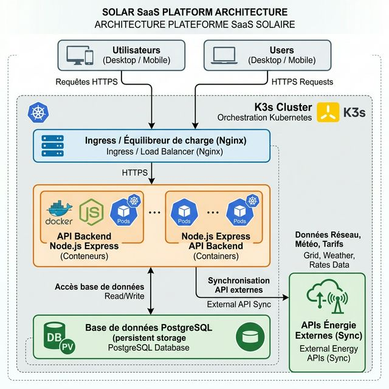
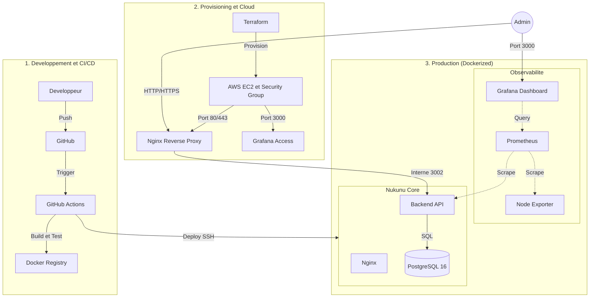
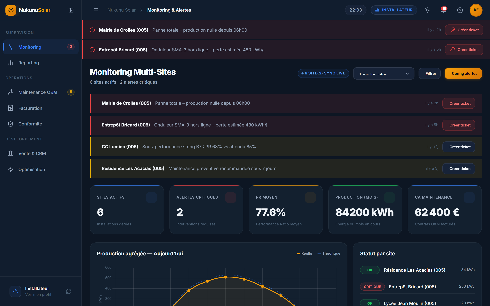
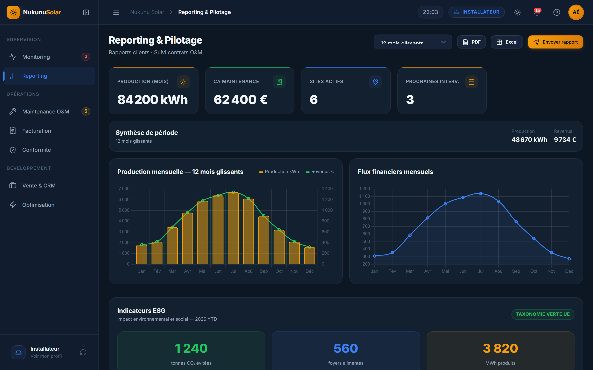
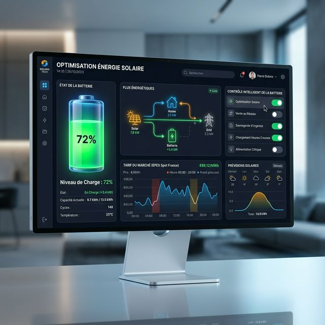

# Nukunu Solar - Plateforme SaaS d'Optimisation Energetique

## Presentation du Projet
Nukunu Solar est une solution logicielle industrielle concue pour repondre aux defis technologiques et financiers de la filiere photovoltaique. Elle s'adresse specifiquement aux Installateurs, aux Fonds d'investissement, aux Industriels ainsi qu'aux Particuliers. 

La plateforme centralise la collecte de donnees en temps reel issues des capteurs IoT, la maintenance predictive (O&M), l'automatisation de la facturation complexe et l'optimisation intelligente des flux energetiques. En integrant des algorithmes de gestion du stockage par batterie et d'arbitrage sur les marches de l'electricite, Nukunu Solar permet de maximiser la rentabilite et la duree de vie des actifs solaires.

---

## Architecture Detaillee

Le systeme repose sur une architecture distribuee, entierement conteneurisee et hautement securisee, pensee pour la haute disponibilite et la stabilite en production.

### Schema d'Architecture


### Couches Techniques
1. **Couche Presentation (Frontend)** : Interface de type Single Page Application (SPA) developpee en JavaScript Vanille ES6 et CSS moderne. Elle met en oeuvre un Design System proprietaire et un moteur de themes dynamique permettant une immersion totale pour les utilisateurs finaux.
2. **Couche Logique (Backend API)** : Serveur d'API robuste base sur Node.js et le framework Express.js. Il assure l'orchestration de la logique metier, la gestion fine des droits via l'authentification JSON Web Token (JWT) et l'exposition des metriques de performance via prom-client.
3. **Couche Persistance (Base de Donnees)** : Instance PostgreSQL 16 utilisant une structure relationnelle normalisee. Cette couche garantit une isolation stricte des donnees par utilisateur et par role, assurant ainsi la confidentialite et l'integrite des informations financieres et techniques.
4. **Monitoring et Observabilite** :
    - **Prometheus** : Moteur de collecte de metriques temporelles charge de recuperer les donnees applicatives et systeme a intervalles reguliers.
    - **Grafana** : Interface de visualisation de haut niveau permettant de creer des tableaux de bord interactifs pour la supervision continue.
    - **Node Exporter** : Agent specialise dans la collecte des metriques materielles (CPU, RAM, Disque) directement sur l'instance cloud.
5. **Infrastructure et Orchestration** :
    - **Cloud Computing** : Deploiement sur instance AWS EC2 t3.micro (Region Irlande) optimisee pour le Free Tier, incluant une gestion de la memoire virtuelle (Swap 2Go) pour garantir la stabilite des services de monitoring.
    - **Orchestration** : Utilisation de Docker et Docker Compose pour la gestion du cycle de vie des conteneurs en production.
    - **Automatisation** : Mise en oeuvre de l'Infrastructure as Code (IaC) avec Terraform et gestion de la configuration avec Ansible.

### Visualisation du Workflow de Deploiement


---

## Apercu de l'Interface et Fonctionnalites

### 1. Supervision et Metrics Systeme
Le monitoring permet une visibilite totale sur la production energetique, l'irradiance solaire et les indicateurs de performance (Performance Ratio). Le dashboard Grafana integre fournit egalement une vue sur l'etat de sante de l'infrastructure serveurs.


### 2. Gestion Financiere et Reporting ESG
Cette fonctionnalite permet aux gestionnaires d'actifs de generer des rapports mensuels, d'analyser les flux de tresorerie et de suivre les indicateurs environnementaux requis pour la conformite extra-financiere.


### 3. Optimisation et Flux Energetiques
Algorithmes dedies a la gestion intelligente de l'autoconsommation, incluant le controle des systemes de stockage et les echanges avec le reseau de distribution electrique selon les fluctuations des prix du marche.


---

## Stack Technique Complete
Le projet Nukunu Solar a ete construit avec des technologies selectionnees pour leur stabilite et leur performance :
- **Environnement Backend** : Node.js (v22) utilisant l'architecture Express.js pour une gestion asynchrone des flux de donnees.
- **Interface Frontend** : Utilisation des standards Web HTML5, CSS3 et JavaScript ES6 pour une interface legere et reactive sans dependances lourdes.
- **Supervision et Monitoring** : Stack complete Grafana, Prometheus et Node Exporter pour une observabilite de niveau entreprise.
- **Moteur de Base de Donnees** : PostgreSQL 16 assurant la fiabilite des transactions et la persistence des logs historiques.
- **Infrastructure Cloud** : Services Amazon Web Services (AWS) EC2 bases en Irlande (eu-west-1a).
- **Outils DevOps** : Terraform pour l'infrastructure programmable, Ansible pour la gestion de configuration et GitHub Actions pour le pipeline d'integration continue.

---

## Installation et Procedures de Deploiement

### Environnement de Developpement Local
Pour lancer l'environnement complet de developpement incluant l'application et les outils de monitoring :
```bash
# Lancement des conteneurs via Docker Compose
docker compose -f infra/docker/docker-compose.yml up -d
```

### Deploiement et Maintenance Cloud
Le deploiement sur l'infrastructure de production est integralement automatise grace a GitHub Actions. Cette approche garantit une qualite constante et une securite accrue en eliminant les erreurs humaines lors des mises a jour.

**Acces aux Environnements de Production :**
- **URL de l'Application** : [http://34.243.44.194](http://34.243.44.194) - Interface utilisateur et API (via Nginx Reverse Proxy).
- **Interface Monitoring** : [http://34.243.44.194:3000](http://34.243.44.194:3000) - Dashboards de supervision technique.

**Identifiants pour les Tests (Profil Super Admin) :**
Pour tester les fonctionnalites d'administration, vous pouvez utiliser les identifiants suivants, pre-configures dans la base de donnees via les scripts de migration :
- **Email** : superadmin@nukunu.com
- **Mot de passe** : superpassword123

---

## Ressources Supplementaires et Documentation
Pour approfondir votre connaissance du projet, veuillez consulter les guides suivants situes dans le repertoire docs :
- **Architecture et Outils** (docs/architecture_and_tools.md) : Analyse technique approfondie des choix architecturaux et des flux de donnees.
- **Procedure de Deploiement AWS** (docs/aws-deployment.md) : Guide pas-a-pas sur l'utilisation de Terraform et Ansible pour recréer l'infrastructure.

---

Projet developpe par DJOMATIN AHO Christian dans le cadre de la certification ASD. Toute reproduction ou modification doit respecter la licence originale du projet.
