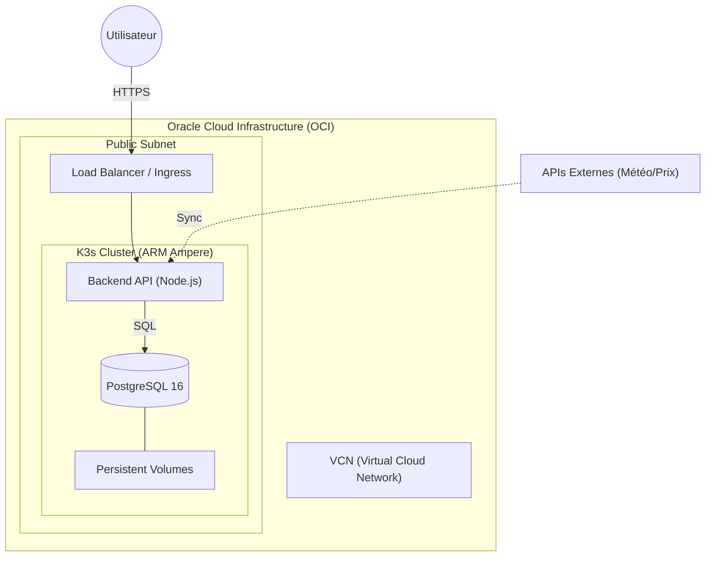

# Nukunu Solar — Plateforme SaaS d'Optimisation Énergétique

## 🌟 Présentation du Projet
Nukunu Solar est une solution logicielle innovante conçue pour les acteurs de la filière photovoltaïque (**Installateurs, Fonds d'investissement, Industriels et Particuliers**). 

La plateforme centralise le monitoring en temps réel, la maintenance O&M, l'automatisation de la facturation et l'optimisation des flux énergétiques (stockage batterie et arbitrage marché) pour maximiser la rentabilité des actifs solaires.

---

## 🏗️ Architecture Détaillée

Le système repose sur une architecture distribuée, conteneurisée et hautement sécurisée, conçue pour la scalabilité.

### Schéma d'Architecture


### Couches Techniques
1. **Couche Présentation (Frontend)** : Interface Single Page Application (SPA) développée en Vanilla JS ES6 et CSS moderne (Design System sur mesure). Elle intègre un moteur de thèmes dynamique (Clair/Sombre).
2. **Couche Logique (Backend API)** : Serveur Node.js sous Express.js assurant la logique métier, l'authentification JWT et l'isolation stricte des données par rôle.
3. **Couche Persistance (Base de Données)** : PostgreSQL 16 avec une structure relationnelle normalisée, permettant une séparation logique robuste entre les différents profils utilisateurs.
4. **Infrastructure & Orchestration** : 
   - **Cloud** : Instances ARM Ampere A1 sur Oracle Cloud Infrastructure (OCI).
   - **Orchestration** : Kubernetes léger (K3s) pour la résilience et le self-healing.
   - **Automatisation** : Terraform (IaC) et Ansible pour garantir des environnements reproductibles et idempotents.

### Visualisation Mermaid (Infrastructure)


#### Détails des Composants :
- **Utilisateur** : Accès sécurisé via HTTPS à l'application.
- **Load Balancer / Ingress** : Gère la terminaison SSL et distribue le trafic vers les pods du cluster.
- **K3s Cluster (ARM)** : Orchestrateur Kubernetes optimisé pour les ressources ARM (OCI Ampere), assurant la haute disponibilité et le redémarrage automatique des services.
- **Backend API (Node.js)** : Le "cœur" applicatif qui traite les requêtes, gère les sessions JWT et assure l'isolation des données entre les rôles.
- **PostgreSQL 16** : Base de données relationnelle stockant les assets, les mesures et les documents de conformité.
- **Persistent Volumes (FS)** : Garantie de persistance des données DB même en cas de redémarrage des conteneurs.
- **APIs Externes** : Connecteurs synchrones pour enrichir les dashboards avec des données d'ensoleillement et les prix du marché de l'énergie (EPEX Spot).

#### Flux de Données & Interactions :
1. **Requêtes Client** : L'utilisateur initie une connexion sécurisée (HTTPS). Le **Load Balancer** intercepte la requête et la transmet au service **API** disponible dans le cluster.
2. **Traitement & Auth** : L'**API** valide l'identité (JWT). Si l'accès est autorisé, elle interroge la **Base de Données** via des requêtes SQL optimisées.
3. **Persistance** : Toutes les transactions sont écrites sur des **Volumes Persistants** (FS) pour assurer la durabilité des données.
4. **Synchronisation Externe** : En arrière-plan, l'API interroge périodiquement des **Services Externes** (Météo/Prix) pour maintenir les dashboards à jour sans intervention utilisateur.

#### 📝 Guide de Lecture du Diagramme :
- **Compartimentation (Subgraphs)** : 
    - `OCI` : Délimite la bordure de confiance de l'infrastructure Cloud.
    - `Subnet` : Représente la zone réseau publique où le trafic entrant est filtré.
    - `K3s Cluster` : Matérialise l'orchestration logicielle.
- **Sémantique des Noeuds** :
    - `Utilisateur(( ))` : Cercle double pour un acteur externe.
    - `DB[( )]` : Forme de cylindre pour la base de données persistante.
    - `API[ ]` : Rectangle pour un service applicatif.
- **Relations** :
    - `Ligne Pleine (-->)` : Requête synchrone (HTTP/SQL).
    - `Ligne Pointillée (-.->)` : Flux asynchrone ou synchronisation périodique.

### ⚙️ Analyse Technique de l'Infrastructure
L'architecture a été conçue pour maximiser l'efficacité opérationnelle et la sécurité :

- **Optimisation ARM (OCI Ampere)** : Le choix des instances Ampere A1 permet de bénéficier d'un rapport performance/prix supérieur pour les workloads Node.js, tout en s'inscrivant dans une démarche d'efficience énergétique au sein du cloud Oracle.
- **Orchestration K3s** : Préféré à un Kubernetes standard pour sa légèreté, K3s permet de maintenir une gestion de conteneurs de niveau production avec un overhead minimal, idéal pour une infrastructure SaaS agile.
- **Segmentation Réseau (VCN & Subnets)** : Le diagramme illustre une stratégie de défense en profondeur. Le trafic arrive via un Load Balancer public, filtré par des Security Lists, avant d'atteindre le cluster interne.
- **Gestion du State (Persistance)** : La base de données PostgreSQL est isolée et couplée à des volumes de stockage persistants (OCI Block Volumes), garantissant que les données critiques de production ne sont jamais perdues lors des rotations de pods.

---

## 📸 Aperçu de l'Interface (Mockups Réels)

### 1. Monitoring Temps Réel
Suivi précis de la production, de l'irradiance et de la performance (PR) des sites.


### 2. Reporting & ESG
Analyses mensuelles, revenus financiers et indicateurs d'impact environnemental.


### 3. Optimisation Énergétique
Gestion intelligente des batteries, flux de puissance et arbitrage des prix Spot.


---

## 🛠️ Stack Technique
- **Backend** : Node.js / Express.js / JWT
- **Frontend** : HTML5 / Modern CSS / Javascript ES6
- **Base de Données** : PostgreSQL 16
- **Infrastructure** : OCI / K3s / Docker
- **Automatisation** : Terraform / Ansible / CI-CD (GitHub Actions & GitLab CI)

---

## 🚀 Installation & Déploiement

### Local (Docker Compose)
```bash
# Lancement de la stack complète
docker-compose -f docker/docker-compose.yml up -d
```

### Vérification
Un script de healthcheck est disponible pour valider l'état des services après déploiement :
```bash
./scripts/verify/check-deployment.sh
```

---

*Projet développé par [DJOMATIN AHO Christian](https://github.com/DJOMATIN-AHO-Christian) dans le cadre de la certification ASD.*
