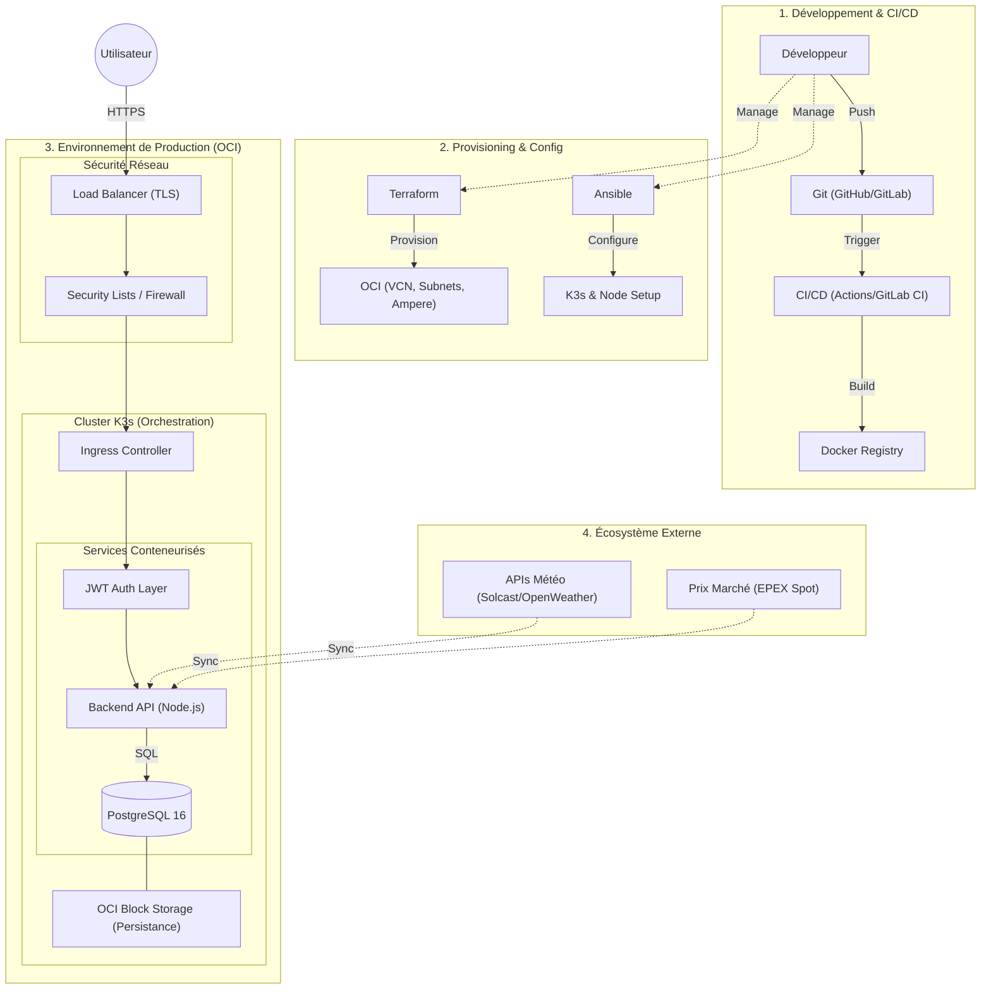

# Nukunu Solar — Plateforme SaaS d'Optimisation Énergétique

## Présentation du Projet
Nukunu Solar est une solution logicielle innovante conçue pour les acteurs de la filière photovoltaïque (**Installateurs, Fonds d'investissement, Industriels et Particuliers**). 

La plateforme centralise le monitoring en temps réel, la maintenance O&M, l'automatisation de la facturation et l'optimisation des flux énergétiques (stockage batterie et arbitrage marché) pour maximiser la rentabilité des actifs solaires.

---

## Architecture Détaillée

Le système repose sur une architecture distribuée, conteneurisée et hautement sécurisée, conçue pour la scalabilité.

### Schéma d'Architecture


### Couches Techniques
1. **Couche Présentation (Frontend)** : Interface Single Page Application (SPA) développée en Vanilla JS ES6 et CSS moderne (Design System sur mesure). Elle intègre un moteur de thèmes dynamique (Clair/Sombre).
2. **Couche Logique (Backend API)** : Serveur Node.js sous Express.js assurant la logique métier, l'authentification JWT et l'isolation stricte des données par rôle.
3. **Couche Persistance (Base de Données)** : PostgreSQL 16 avec une structure relationnelle normalisée, permettant une séparation logique robuste entre les différents profils utilisateurs.
4. **Infrastructure & Orchestration** : 
   - **Cloud** : Instances ARM Ampere A1 sur Oracle Cloud Infrastructure (OCI).
   - **Orchestration** : Kubernetes léger (K3s) pour la résilience et le self-healing.
   - **Automatisation** : Terraform (IaC) et Ansible pour garantir des environnements reproductibles et idempotents.

### Visualisation Interactive (Cycle de Vie & Infrastructure)


---

## Aperçu de l'Interface (Mockups Réels)

### 1. Monitoring Temps Réel
Suivi précis de la production, de l'irradiance et de la performance (PR) des sites.


### 2. Reporting & ESG
Analyses mensuelles, revenus financiers et indicateurs d'impact environnemental.


### 3. Optimisation Énergétique
Gestion intelligente des batteries, flux de puissance et arbitrage des prix Spot.


---

## Stack Technique
- **Backend** : Node.js / Express.js / JWT
- **Frontend** : HTML5 / Modern CSS / Javascript ES6
- **Base de Données** : PostgreSQL 16
- **Infrastructure** : OCI / K3s / Docker
- **Automatisation** : Terraform / Ansible / CI-CD (GitHub Actions & GitLab CI)

---

## Installation & Déploiement

### Local (Docker Compose)
```bash
# Lancement de la stack complète
docker-compose -f docker/docker-compose.yml up -d
```

### Vérification
Un script de healthcheck est disponible pour valider l'état des services après déploiement :
```bash
./scripts/verify/check-deployment.sh
```

---

*Projet développé par [DJOMATIN AHO Christian](https://github.com/DJOMATIN-AHO-Christian) dans le cadre de la certification ASD.*
