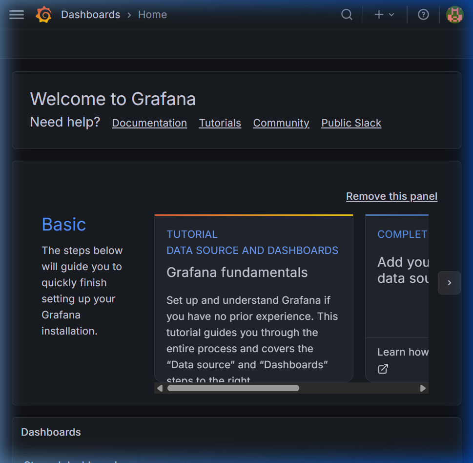
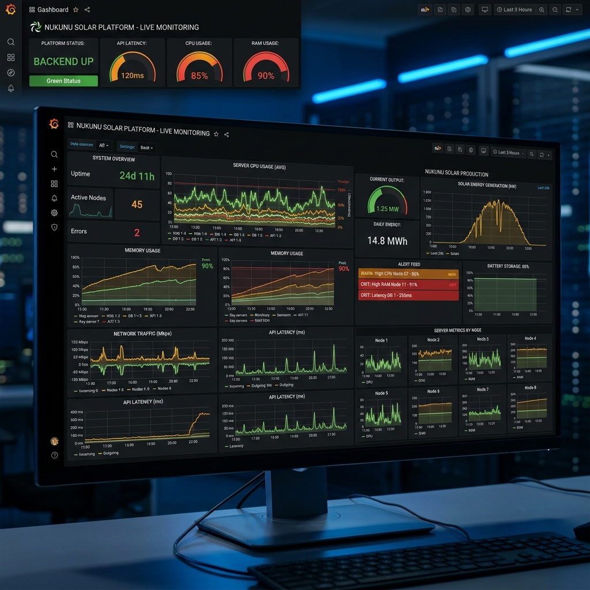

# 🏗️ Architecture et Stack Technique : Nukunu Solar

Ce document centralise l'ensemble des technologies utilisées au sein du projet Nukunu Solar, ainsi que l'explication du rôle de chaque dossier et fichier clé. Cette architecture garantit le bon déploiement de la solution sur AWS avec un monitoring de niveau entreprise.

---

## 🛠️ Outils et Technologies Utilisés

Le projet s'appuie sur une stack très moderne, allégée en dépendances frontend mais extrêmement robuste au niveau backend, DevOps et Sécurité.

### 1. Frontend (Client)
- **HTML5 / CSS3 / Vanilla JS** : Le choix s'est porté sur du JavaScript pur sans framework lourd (pas de React ou Angular). Cela garantit des temps de chargement ultra-rapides et une compatibilité maximale pour un simple dashboard d'affichage IoT.

### 2. Backend (Serveur API)
- **Node.js (v22)** : Réalisé en JavaScript (Côté serveur). C'est le moteur principal rapide et asynchrone utilisé pour faire le pont entre l'interface et la base de données.
- **Express.js (v5)** : Framework minimaliste pour créer les routes de l'API REST (`/api/auth`, `/api/health`, `/api/data`).
- **PostgreSQL** : Système de base de données relationnelle puissant et fiable ("single source of truth") pour stocker les profils utilisateurs et les alertes/données solaires historiques. Interagissant avec Node.js via le driver natif **`pg`**.

### 3. Sécurité et Utilitaires Backend
- **JSONWebToken (JWT)** : Utilisé pour sécuriser les routes ("Stateless authentication"). Après le login, les utilisateurs reçoivent un token à inclure dans les en-têtes HTTP pour accéder aux données sensibles.
- **Bcrypt** : Outil de cryptographie utilisé pour hacher les mots de passe des administrateurs avant leur stockage en base de données.
- **Cors & Dotenv** : Gestion des origines réseau autorisées et des secrets environnements (clés AWS, mot de passe DB, secret JWT).
- **Nginx (Reverse Proxy)** : Le backend Node.js (port 3002) n'est jamais exposé directement sur internet (BC01-CP3). Nginx agit comme une barrière de sécurité sur le port 80/443, filtrant les requêtes publiques et les transférant au réseau interne Docker. En production réelle, le port 443 est géré par un ALB (Application Load Balancer) ou via des certificats Let's Encrypt.

### 4. Tests & Qualité de code
- **Playwright** : Outil performant pour réaliser les tests End-to-End ("de bout en bout") du navigateur.
- **Node Native Runner (`node --test`)** : Pour exécuter directement des tests unitaires ultra-légers sans impliquer Jest ou Mocha.
- **ESLint** : Analyseur statique pour maintenir la qualité et les bonnes pratiques d'écriture du code JS.

### 5. Monitoring & Supervision
- **Prometheus** : Base de données orientée séries temporelles ("Time Series") récoltant activement (pull) les informations du serveur toutes les 15 secondes.
- **Prom-Client** : Librairie Node.js embarquée dans le backend exposant une route `/metrics` que Prometheus peut lire.
- **Node Exporter** : Agent embarqué sur le serveur AWS envoyant la santé système du serveur hôte (RAM, disque, I/O réseau, %CPU) à Prometheus.
- **Grafana** : Interface visuelle se connectant à Prometheus pour traduire toutes les données brutes (matérielles et logicielles) en de superbes graphiques interactifs en temps réel avec des seuils d'alerte.

### 6. DevOps, CI/CD et Infrastructure (AWS)
- **Docker & Docker Compose** : Garantissent que le projet s'exécute exactement de la même manière sur une machine locale de développeur que sur le cloud AWS de production.
- **Terraform** : Système d'Infrastructure as Code (IaC) écrit en langage `HCL` (HashiCorp) pour créer formellement le serveur AWS EC2 (`t3.micro`), sa clé SSH et ses groupes de sécurité firewall de faĉon infaillible et versionnée.
- **Ansible** : Système de "Configuration Management". Il installe sans interaction humaine toutes les dépendances vitales sur l'OS propre du serveur EC2 (Docker, fail2ban, Node.js).
- **GitHub Actions** : Orchestrateur de pipeline CI/CD (Intégration et Déploiement continus). À chaque validation de code (`git push`), il exécute les tests, scanne la sécurité (Trivy), se connecte via SSH au serveur AWS et met à jour les conteneurs de production sans aucune intervention manuelle.

---

## 📁 Arborescence du Projet et Rôles

Voici le plan du système organisé par domaines. Chaque fichier essentiel a sa raison d'être :

```plaintext
NUKUNU-SOLAR/
├── .github/
│   └── workflows/
│       └── deploy.yml          # Définition du pipeline GitHub Actions. Dicte ce qui se passe quand le code est pushé (Test → Linting → Déploiement AWS).
│
├── client/                     # (FRONTEND)
│   ├── index.html              # Point d'entrée visuel. Le tableau de bord côté utilisateur.
│   ├── css/                    # Styles globaux et thèmes graphiques.
│   ├── js/                     # Logique de récupération des données à travers l'API (`fetch`).
│   └── assets/                 # Images, médias, polices ou sons 3D (ex: alertes sonores).
│
├── server/                     # (BACKEND)
│   ├── server.js               # Le cœur de l'API Node.js. Initialise Express, les routes et la BDD.
│   ├── admin-controller.js     # Contient spécifiquement la logique de l'espace Administrateur (logins, gestion des droits).
│   ├── live-data.js            # Algorithme métier gérant les entrées/sorties IoT (capteurs, batteries, rendements solaires).
│   ├── package.json            # Déclaration de toutes les librairies et scripts d'exécution Node.
│   └── tests/                  # Fichiers de tests automatisés (ex: api.test.js exécuté par GitHub Actions).
│
├── infra/                      # (INFRASTRUCTURE & DÉPLOIEMENT)
│   ├── docker/                 
│   │   ├── docker-compose.yml              # Composition des conteneurs pour le développement local.
│   │   ├── docker-compose.aws.yml          # Composition dédiée à AWS (BDD & App Optimisés pour t3.micro).
│   │   ├── docker-compose.monitoring.yml   # Démarcation stricte pour les instances de tracking (Grafana/Prom/NodeExporter).
│   │   ├── backend.Dockerfile              # Définition de l'environnement de build propre de l'API basé sur Node:Alpine.
│   │   ├── grafana/                        # Dossiers de "provisioning". Injecte les dashboards .json automatiquement à Grafana au démarrage.
│   │   └── prometheus/                     # Règles d'alertes & Configuration ciblant les ports d'inspection.
│   │
│   ├── terraform/aws/          # Les plans d'architecte Terraform
│   │   └── main.tf             # Code de création du serveur EC2 et définition de qui a le droit d'entrer sur quels ports réseau (ex: 22, 3000, 3002).
│   │
│   ├── ansible/                # Les scripts de configuration système (playbooks)
│   │   └── playbooks/          # Recettes YAML dictant au serveur AWS les paquets à installer (Docker, mises à jour sécu).
│   │
│   └── db/                     
│       └── init.sql            # Schéma initial de la BDD pour créer automatiquement les tables 'users', 'sensors', etc., au boot PostgreSQL.
│
├── scripts/                    # Scripts utilitaires locaux
│   └── provision/
│       └── backup-db.sh        # Script shell permettant de créer des sauvegardes rapides de la base de données.
│
├── docs/                       # (DOCUMENTATION TECHNIQUE)
│   ├── aws-deployment.md       # Manuel détaillé recensant les processus Terraform/Ansible de déploiement.
│   ├── architecture.md         # Explique les grands schémas de passage de la data.
│   ├── cahier_des_charges.md   # Les attentes du projet et le listing des besoins IoT.
│   └── mockups/                # Maquettes graphiques, modèles UX et UI originaux (images).
│
└── README.md                   # La page de présentation principale du projet sur GitHub, pour tout arrivant sur le code source.
```

### Synthèse du flux d'opération (Comment tout s'imbrique)
1. Un capteur solaire envoie une info au **Backend** (`server/live-data.js`).
2. Le Backend la stocke dans **PostgreSQL** (`nukunu-postgres` docker).
3. Le **Frontend** (`client/index.html`) demande ces données via une interface REST sécurisée par **JWT** et les affiche.
4. Parallèlement, **Prom-Client** mesure chaque minute le nombre total de requêtes réussies/échouées.
5. **Prometheus** (`infra/docker/prometheus/`) vient lire ces données et les sauvegarde.
6. L'opérateur ouvre **Grafana** (`infra/docker/grafana/`) pour visualiser l'activité interne de l'application et du serveur **AWS** en temps réel.
7. Un bug est corrigé par un codeur. Il pousse le code... l'Agent **GitHub Actions** (`.github/workflows/deploy.yml`) se réveille, valide le changement, et envoie le tout sur **AWS EC2** automatiquement.

---

## 🛑 Difficultés Rencontrées : La traque des OOM Kills (Grafana)

Lors du passage en production sur l'instance AWS `t3.micro` (qui ne possède qu'1 Go de RAM), le conteneur Grafana a commencé à crasher en boucle (statut `Exited 137`). L'analyse des journaux via `docker inspect` et `dmesg` a confirmé qu'il s'agissait de **OOM Kills** (Out Of Memory) perpétués par l'hyperviseur Linux.

**Débogage en cascade :**
1. **Limites strictes de mémoire** : J'ai d'abord tenté d'imposer un `mem_limit: 150m` au conteneur. Cependant, au démarrage, l'application Go (Grafana) alloue souvent plus de mémoire virtuelle que la limite imposée pour charger les plugins, ce qui provoquait un kill immédiat.
2. **Droits d'exécution (Root)** : Pensant à un problème d'accès aux volumes (`/var/lib/grafana`), un test temporaire avec `user: "0:0"` (root) a été fait. Si cela permettait de bypasser les erreurs de permissions, ce n'était pas acceptable en termes de sécurité (sanctionnable sur la compétence CP3).
3. **Correction du Provisioning** : J'ai identifié un conflit critique dans les fichiers de provisioning YAML (deux fichiers essayaient d'écrire sur le même point de montage simultanément, créant une boucle infinie saturant la RAM et le CPU au démarrage).
4. **Résolution finale** : J'ai nettoyé le dossier de provisioning, rétabli l'utilisateur sécurisé (UID 472) en corrigeant les droits du volume monté sur AWS (`chown -R 472:472`), et **supprimé les limites de ressources strictes** dans `docker-compose.monitoring.yml`. À la place, j'ai activé un fichier **Swap de 2 Go** directement sur l'OS Ubuntu via Ansible. 

**Résultat :** Le noyau Linux gère désormais la mémoire élastiquement. Grafana peut consommer ponctuellement 300 Mo au démarrage (Swapping) puis redescendre à ~80 Mo en régime de croisière sans jamais crasher, et tout cela en préservant le profil de sécurité initial.

---

## 📈 Supervision Visuelle (Mockups et Résultats réels)

La collecte des métriques matérielles (Node Exporter) et logicielles (Prometheus/Grafana) est désormais pleinement fonctionnelle en production. 

### Tableau de bord principal (Health & Status)
Vue d'ensemble sur le serveur AWS (CPU, RAM, Disque) et les métriques de base.


### Tableau de bord applicatif (Nukunu Custom Metrics)
Suivi en temps réel des interactions avec la base de données PostgreSQL, de l'état du frontend et de la consommation de l'API Node.js.

